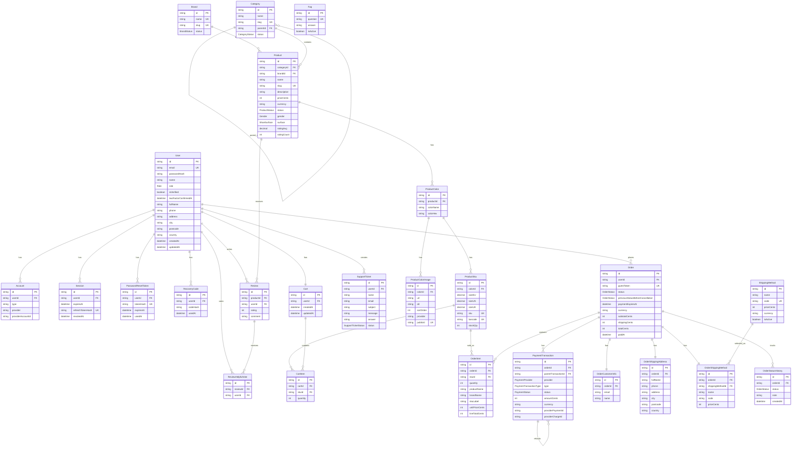

```mermaid
erDiagram

  User ||--o{ Account : has
  User ||--o{ Session : has
  User ||--o{ PasswordResetToken : has
  User ||--o{ RecoveryCode : has
  User ||--|| Cart : has
  User ||--o{ Order : places
  User ||--o{ Review : writes
  User ||--o{ ReviewHelpfulVote : votes
  User ||--o{ SupportTicket : creates

  Brand ||--o{ Product : owns
  Category ||--o{ Product : contains
  Category ||--o{ Category : parent_of

  Product ||--o{ ProductColor : has
  Product ||--o{ Review : receives

  ProductColor ||--o{ ProductColorImage : has
  ProductColor ||--o{ ProductSku : has

  ProductSku ||--o{ CartItem : used_in
  ProductSku ||--o{ OrderItem : sold_as

  Cart ||--o{ CartItem : contains

  Order ||--o{ OrderItem : contains
  Order ||--o{ PaymentTransaction : has
  Order ||--|| OrderCustomerInfo : has
  Order ||--|| OrderShippingAddress : has
  Order ||--|| OrderShippingMethod : has
  Order ||--o{ OrderStatusHistory : tracks

  ShippingMethod ||--o{ OrderShippingMethod : selected_as

  PaymentTransaction ||--o{ PaymentTransaction : refunds

  Review ||--o{ ReviewHelpfulVote : receives

  User {
    string id PK
    string email UK
    string passwordHash
    string name
    Role role
    boolean isVerified
    datetime twoFactorConfirmedAt
    string fullName
    string phone
    string address
    string city
    string postcode
    string country
    datetime createdAt
    datetime updatedAt
  }

  Account {
    string id PK
    string userId FK
    string type
    string provider
    string providerAccountId
  }

  Session {
    string id PK
    string userId FK
    datetime expiresAt
    string refreshTokenHash UK
    datetime revokedAt
  }

  PasswordResetToken {
    string id PK
    string userId FK
    string tokenHash UK
    datetime expiresAt
    datetime usedAt
  }

  RecoveryCode {
    string id PK
    string userId FK
    string codeHash
    datetime usedAt
  }

  Brand {
    string id PK
    string name UK
    string slug UK
    BrandStatus status
  }

  Category {
    string id PK
    string name
    string slug UK
    string parentId FK
    CategoryStatus status
  }

  Product {
    string id PK
    string categoryId FK
    string brandId FK
    string name
    string slug UK
    string description
    int priceCents
    string currency
    ProductStatus status
    Gender gender
    ShoeSurface surface
    decimal ratingAvg
    int ratingCount
  }

  ProductColor {
    string id PK
    string productId FK
    string colorName
    string colorHex
  }

  ProductColorImage {
    string id PK
    string colorId FK
    string url
    string alt
    int sortOrder
    string provider
    string publicId UK
  }

  ProductSku {
    string id PK
    string colorId FK
    decimal sizeEU
    decimal sizeUS
    decimal sizeUK
    string sku UK
    string barcode UK
    int stockQty
  }

  Cart {
    string id PK
    string userId FK
    datetime createdAt
    datetime updatedAt
  }

  CartItem {
    string id PK
    string cartId FK
    string skuId FK
    int quantity
  }

  Order {
    string id PK
    string userId FK
    string guestToken UK
    OrderStatus status
    OrderStatus previousStatusBeforeCancellation
    datetime paymentExpiresAt
    string currency
    int subtotalCents
    int shippingCents
    int totalCents
    datetime paidAt
  }

  OrderItem {
    string id PK
    string orderId FK
    string skuId FK
    int quantity
    string productName
    string brandName
    string skuLabel
    int unitPriceCents
    int lineTotalCents
  }

  OrderCustomerInfo {
    string id PK
    string orderId FK
    string email
    string name
  }

  OrderShippingAddress {
    string id PK
    string orderId FK
    string fullName
    string phone
    string address
    string city
    string postcode
    string country
  }

  ShippingMethod {
    string id PK
    string name
    string code UK
    int priceCents
    string currency
    boolean isActive
  }

  OrderShippingMethod {
    string id PK
    string orderId FK
    string shippingMethodId FK
    string name
    string code
    int priceCents
  }

  OrderStatusHistory {
    string id PK
    string orderId FK
    OrderStatus status
    string note
    datetime createdAt
  }

  PaymentTransaction {
    string id PK
    string orderId FK
    string parentTransactionId FK
    PaymentProvider provider
    PaymentTransactionType type
    PaymentStatus status
    int amountCents
    string currency
    string providerPaymentId
    string providerChargeId
  }

  Review {
    string id PK
    string productId FK
    string userId FK
    int rating
    string comment
  }

  ReviewHelpfulVote {
    string id PK
    string reviewId FK
    string userId FK
  }

  SupportTicket {
    string id PK
    string userId FK
    string name
    string email
    string subject
    string message
    string answer
    SupportTicketStatus status
  }

  Faq {
    string id PK
    string question UK
    string answer
    boolean isActive
  }
```
