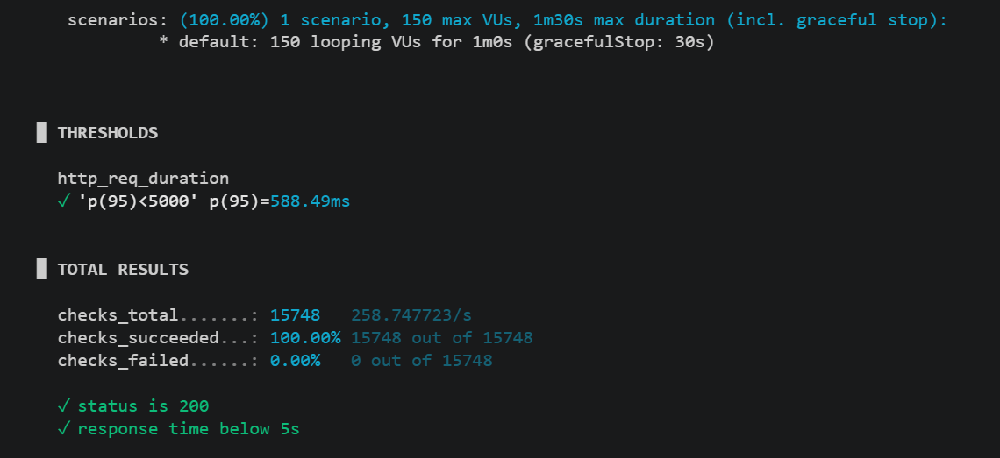
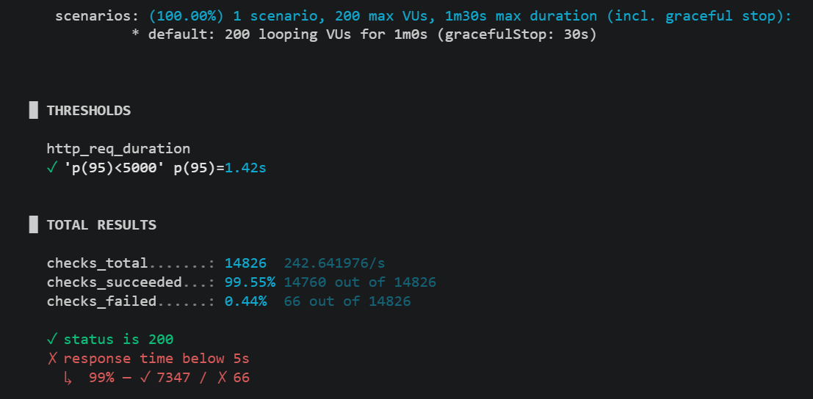
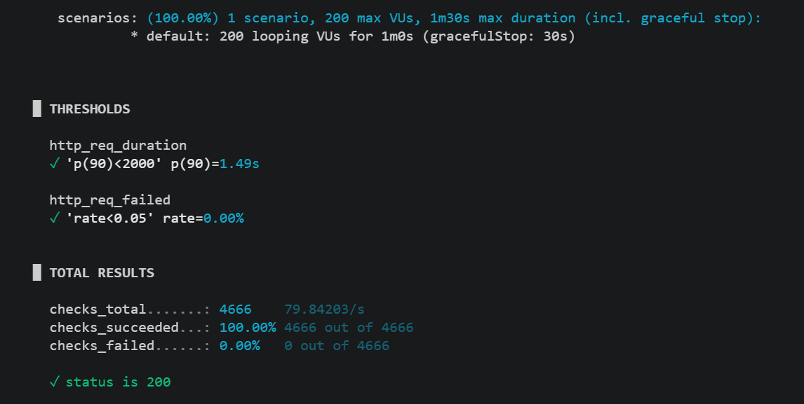
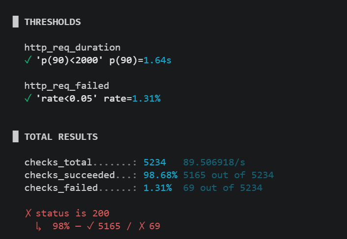
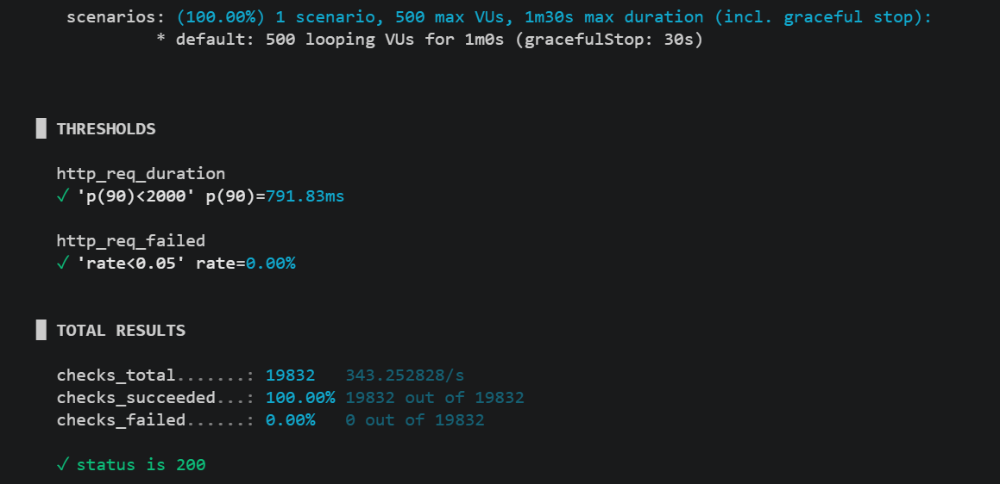
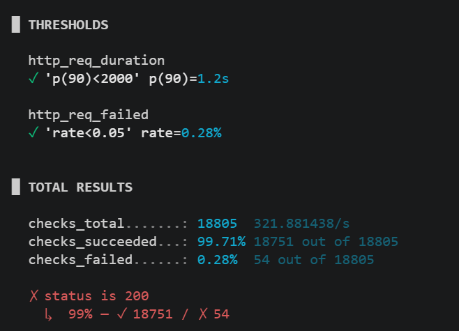
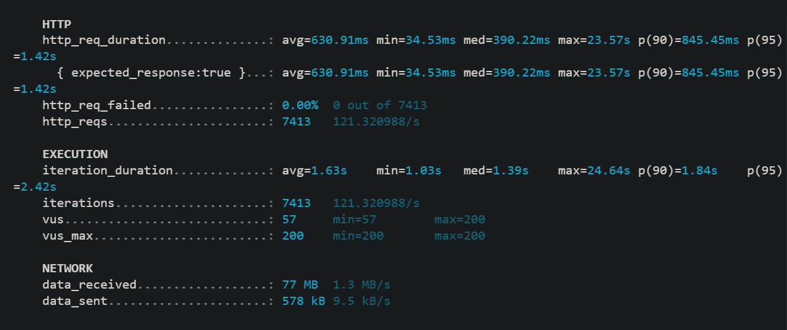

# Performance and Load Testing Report

## Overview

The purpose of these load tests was to evaluate the performance, scalability, and stability of the MoveOn e-commerce platform under increasing user traffic.

Testing focused on realistic user activities:

- Browsing product catalogs
- Searching for products
- Viewing product details

The tests were designed to verify the following performance objectives:

| Requirement | Target |
|------------|---------|
| Response Time | 90% of requests completed within 2 seconds |
| Concurrent Users | At least 50 concurrent users |
| Throughput | At least 10 transactions per second |
| Success Rate | At least 98% successful transactions |
| Error Rate | Less than 5% |
| Maximum Load | Identify maximum concurrent users before response times exceed 5 seconds |

---

# Testing Environment

## Load Testing Tool

All tests were performed using **k6**.

## General Test Methodology

Each scenario was executed for 1 minute while gradually increasing the number of concurrent users (Virtual Users - VUs).

The following metrics were monitored:

- Response time
- Throughput (requests per second)
- Success rate
- Error rate
- System stability

---

# Scenario 1 – Product Catalog Browsing

## Objective

Simulate users browsing the product catalog.

### Endpoint

```http
GET /products
```

## Test Results

### 150 Concurrent Users

| Metric | Result |
|---|---|
| p95 Response Time | 588.49 ms |
| Success Rate | 100% |
| Error Rate | 0% |



Result:

- All requests completed successfully.
- Response times remained well below 5 seconds.
- No performance degradation observed.

---

### 200 Concurrent Users

| Metric | Result |
|---|---|
| p95 Response Time | 1.42 s |
| Success Rate | 99.55% |
| Error Rate | 0.44% |



Result:

- Performance remained acceptable.
- Some requests exceeded the 5-second requirement.
- First signs of performance degradation appeared.

## Maximum Concurrent Users

The highest fully stable load was:

> **150 concurrent users**

Performance degradation started at:

> **200 concurrent users**

---

# Scenario 2 – Product Search

## Objective

Simulate users searching products by brand.

### Endpoint

```http
GET /products?brand=adidas
```

## Test Results

### 200 Concurrent Users

| Metric | Result |
|---|---|
| Requests per Second | 91.50 |
| p90 Response Time | 47.73 ms |
| Success Rate | 99.05% |
| Error Rate | 0.95% |



---

### 300 Concurrent Users

| Metric | Result |
|---|---|
| Requests per Second | 89.51 |
| p90 Response Time | 1.64 s |
| Success Rate | 98.68% |
| Error Rate | 1.31% |



## Analysis

The search endpoint scaled efficiently.

Even at 300 concurrent users:

- 90% of requests completed within 2 seconds.
- Error rate remained below 5%.
- Success rate remained above 98%.

This exceeds the project performance requirements.

---

# Scenario 3 – Product Details Page

## Objective

Simulate users viewing a product details page.

### Endpoint

```http
GET /products/adidas-dropset-4-women-s-training-shoes-ss26
```

## Test Results

### 500 Concurrent Users



Result:

- Test passed.
- Response time remained within the required threshold.
- Error rate remained below 5%.

---

### 700 Concurrent Users



Result:

- Test failed.
- Response time exceeded acceptable limits.
- Error rate increased beyond the defined threshold.

## Maximum Concurrent Users

The endpoint reliably supported:

> **500 concurrent users**

Performance degradation started between:

> **500 and 700 concurrent users**

---

# Transaction Throughput

## Objective

Measure how many requests the platform can process per second during peak load.

### Endpoint

```http
GET /products
```

## Results

| Metric | Result |
|---|---|
| Total Requests | 7,413 |
| Throughput | 121.32 requests/second |
| Average Response Time | 630.91 ms |
| p95 Response Time | 1.42 s |
| Failed Requests | 0% |



## Analysis

The platform achieved:

> **121.32 transactions per second**

This significantly exceeds the project requirement of:

> **10 transactions per second**

The application remained stable throughout the test.

---

# Performance Bottlenecks

The following areas were identified as potential bottlenecks under heavy traffic:

1. Database queries for products, images, colors, and SKU data.
2. Large response payloads on product details pages.
3. Lack of caching for frequently requested data.
4. Database connection pool limitations.
5. CPU and memory constraints of the local development environment.

## Proposed Optimizations

- Introduce Redis caching for product pages.
- Optimize Prisma database queries.
- Reduce payload size where possible.
- Add database indexes for frequently used filters.
- Scale application instances behind a load balancer.

---

# Normal Operating Conditions

Based on the test results:

| Scenario | Normal Operating Load |
|-----------|---------------------|
| Product Catalog | Up to 150 users |
| Product Search | Up to 200 users |
| Product Details | Up to 500 users |

---

# Expected Peak Load

Based on successful stress testing:

| Scenario | Peak Load |
|-----------|-----------|
| Product Catalog | 200 users |
| Product Search | 300 users |
| Product Details | 500 users |

Beyond these levels, response times begin to increase significantly and reliability decreases.

---

# CPU and Memory Utilization

## Objective

The purpose of this test was to determine whether CPU or memory resources become a limiting factor under heavy load.

## Test Configuration

| Setting | Value |
|---|---|
| Scenario | Product Details Page |
| Endpoint | GET /products/adidas-dropset-4-women-s-training-shoes-ss26 |
| Concurrent Users | 1500 |
| Monitoring Tool | Windows Task Manager |

## Results

| Resource | Maximum Observed Usage |
|---|---|
| CPU Usage | 77% |
| Processor | AMD Ryzen 5 3500U |
| Physical Cores | 4 |
| Logical Processors | 8 |

## Analysis

System resources were monitored during the highest-load test scenario.

At 1500 concurrent users, CPU utilization reached a maximum of 77%, remaining below the 90% threshold. Performance degradation occurred before CPU resources became fully saturated, suggesting that the primary bottlenecks are related to application processing and database operations rather than hardware limitations.

Potential bottlenecks include:

- Database query performance
- Product detail data retrieval
- Large response payloads
- Backend request processing overhead
- Lack of caching for frequently requested data

## Conclusion

CPU utilization did not exceed 90% during testing, even under a load of 1500 concurrent users.

The application reached its practical performance limits before hardware resources became saturated, indicating that software-level optimizations would provide greater performance improvements than additional hardware resources.

---

# Final Conclusion

The MoveOn platform successfully meets all required load testing objectives.

✓ Supports significantly more than 50 concurrent users

✓ Maintains response times below 2 seconds for most scenarios

✓ Achieves more than 98% successful transactions

✓ Maintains an error rate below 5%

✓ Achieves a throughput of 121.32 transactions per second

✓ Identifies maximum concurrent user capacity before performance degradation

✓ Identifies potential performance bottlenecks and future optimization opportunities

The platform is capable of supporting normal production traffic and moderate peak traffic while maintaining acceptable performance levels.
---
